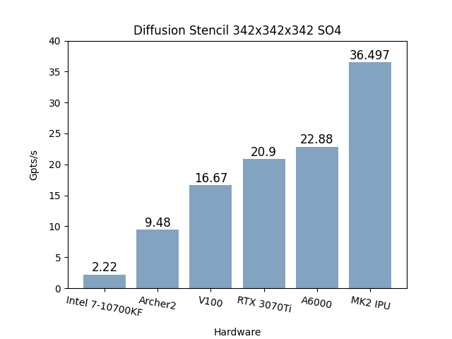
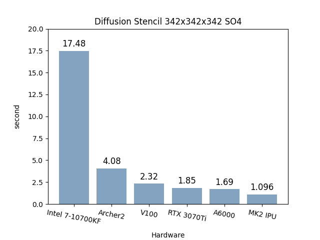
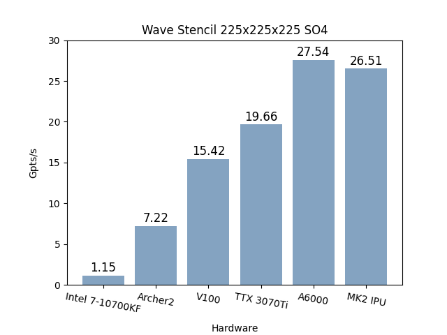
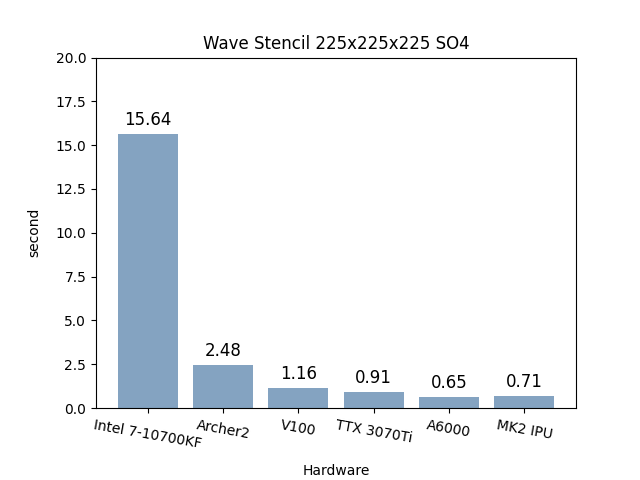
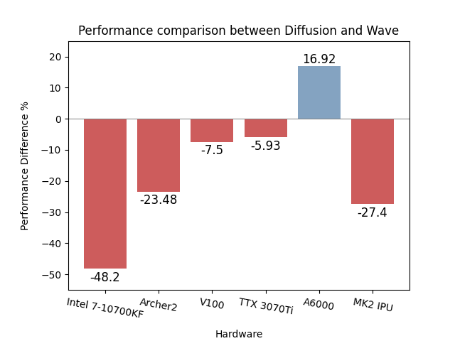
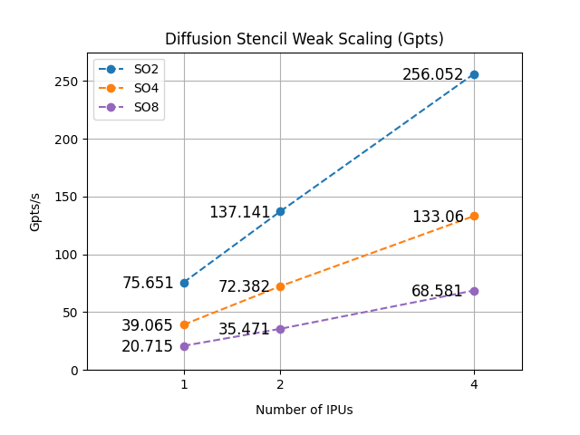
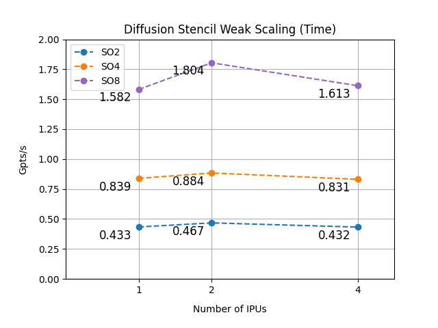
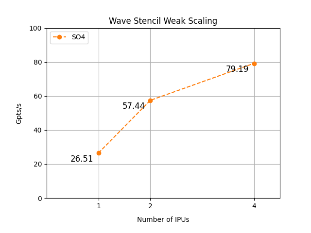
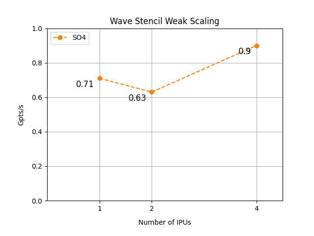

# Exploiting Graphcore IPU for Finite Stencil Computation

2 Partial Differential Equations: The Diffusion and Wave Equations were implemented on the Graphcore [IPU](https://www.graphcore.ai/products/ipu). This work is part of a Final Year Project with Imperial College London, submitted June 2023. It references and builds on the work of [Simon Hapnås](https://github.com/simehaa/IPU).


# Get-Started

Two Partial Differential Equations (PDEs) were implemented for the IPU with the help of the [Devito](https://www.devitoproject.org/) Compiler. 


Within `IPU/DiffusionEquation2D` contains folder `SO2` `SO4` `SO8`. A `runBenchMark.sh` is included within each folder to run the experiments documented below. Results are stored in the respective `BenchMarks` folder.

Within `IPU/DiffusionEquation2D` contains a folder `TO2`. A `runBenchMark.sh` is also included, in addition readers use `-i` to re-run IPU results using stored graphs and parameters; `-p` to plot results for the experiment ran; `-t` to run a mini scale program; `-r` to remove all the file generated in the process. Results are stored in the respective `BenchMarks` folder. 

> User might run out of memory for the 350 wave equation for 4 IPUs. Avoid using Visual Studio Code to save memory for Compilation.
> screen utility is installed below in the required packages, and users are recommended to use it when running experiments

Within `IPU/HeatEquation3D` contains the work by Simon Hopnås on 3D HeatEquation. It is included for testing the reproducibility of results.

## Required Packages
Install the following required packages (or run `./requiredMod.sh`)
```
sudo apt-get update
sudo apt-get install software-properties-common protobuf-compiler  -y
sudo apt-get install build-essential g++ python3-dev autotools-dev libicu-dev libbz2-dev libboost-all-dev -y
sudo apt-get install python3.8-venv screen -y
```
For the Wave Equation, 2 additional packages are needed. Follow the link below to complete installation.

**Devito Compiler**:
https://www.devitoproject.org/devito/download.html

**nlohmann JSON library**: https://github.com/nlohmann/json 

For the nholmann JSON library, using `cget` might be the easiest installation. The following might also be useful in getting Makefile to recognise the library.

>Pkg-config
>If you are using bare Makefiles, you can use pkg-config to generate the include flags that point to where the library is installed:
>
>```pkg-config nlohmann_json --cflags```


# Abstract

*Stencil computation is essential in numerically solving Partial Differential Equations (PDE). It is
often used in engineering context and presents a major opportunity for optimisation due to the vast
amount of computation it requires. Improving the time required to solve stencil computation has
huge potential to enable new applications. Improvement of hardware is one of the main contrib-
utors to improving stencil computation. This project investigates the potential of the Intelligent
Processing Unit (IPU) in improving stencil computation.*

*The Intelligent Processing Unit (IPU) is a hardware architecture created by Graphcore. Its unique
hardware architecture enables a combination of different parallelism techniques to be employed.
On top of the traditional Single Instruction Multiple Data (SIMD), the fine-grained threaded model
employed on modern multi-core CPUs, the fabric of tiles in a Graphcore IPU allows programs to
be subdivided into subprograms, effectively enabling Multiple Instruction Multiple Data (MIMD),
so that further parallelism can be achieved.*

*Its uniqueness lies in the close proximity between the processor and its memory, which allows for
extremely fast memory read and write. This project shows that for the diffusion computation on
mesh with elements in the scale of a hundred million elements, the IPU is able to outperform all
alternative hardware. The performance of the IPU is 59.5% better than the next best candidate,
the NVIDIA RTX A6000. With a more complex wave equation, however, the IPU performs 3.7%
worst than NVIDIA RTX A6000. The generalisation of the result to larger problems with different
operational intensities is left as future work.*

*The experiments revealed IPU’s notable weak and strong scaling capabilities. However, it was
observed that the weak scaling capability is lacking when dealing with high memory density prob-
lems. At the same time, space order is also found to have a greater influence on execution time
than the total problem size.*

*The project also highlights the challenges in coding an IPU machine. Specifically, the lack of nativesupport for higher-order arrays in the IPU poplar programming framework makes programming for
higher-order tensors challenging. Moreover, there is a notable increase in control flow overhead as
the time order of the problem grows, and the compile time exhibits poor scalability with increased
space order.*


# Expriment Setup
## Hardware Setup
### GPU
| **Processor** | **GPU Architecture** | **NVIDIA Tensor Cores** | **NVIDIA CUDA® Cores** | **Memory Size** | **Memory Bandwidth** | **Memory Interface** |
|---------------|---------------------|-------------------------|------------------------|-----------------|----------------------|----------------------|
| GeForce RTX 3070 Ti | Ampere | 192 | 6144 | 8 GB | 600 GB/sec | 256-bit |
| NVIDIA Tesla V100 | Volta | 640 | 5120 | 32GB/16GB HBM2 | 900 GB/sec | 4096-bit |
| NVIDIA RTX A6000 | Ampere | 336 | 10,752 | 48 GB GDDR6 | 768 GB/sec | 384-bit |

### Archer 2
| Attributes    | Description    |
|---------------|--------------|
| **Processor** | Archer 2 |
| **Nodes** | 5,860 nodes: 5,276 standard memory, 584 high memory |
| **Processor** | 2× AMD EPYC™ 7742, 2.25 GHz, 64-core |
| **Cores per node** | 128 (2× 64-core processors) |
| **NUMA structure** | 8 NUMA regions per node (16 cores per NUMA region) |
| **Memory per node**| 256 GiB (standard memory), 512 GiB (high memory) |
| **Memory per core** | 2 GiB (standard memory), 4 GiB (high memory) |
| **Interconnect** | HPE Cray Slingshot, 2× 100 Gbps bi-directional per node |

### Intel(R) Core(TM) i7-10700KF CPU
| Attribute                   | Description      |
|-----------------------------|------------|
| CPU(s)                      | 16         |
| thread(s) per core          | 2          |
| Core(s) per socket          | 8          |
| Socket(s)                   | 1          |
| NUMA node(s)                | 8          |
| L2 cache                    | 2 MiB      |
| L1d cache                   | 256 KiB    |
| L3 cache                    | 16 MiB     |
| L1i cache                   | 256 KiB    |
**Note**: all executions used single precision 32-bit floats.

## Software Set-up
| Software                       | Version        |
|---------------------------------|--------------|
| IPU Overall Software Version    | 2.5.0        |
| POPLAR version                  | 3.2.0        |
| ICU firmware Version            | 2.4.4        |
| clang version                   | 15.0.0       |
| Python                          | 3.10.8       |
| Devito                          | 4.8.1        |

# Experiment Setup

Three separate experiments are conducted to measure various aspects of IPU performance. 

## Hardware Comparison
The first experiment runs a fixed size problem with a space order of 4 on the IPU on the listed hardware from previous section. The grid size is set to maximise the memory usage of a single IPU, which is $342^3$ and $225^3$ for the diffusion equation and wave equation, respectively. This experiment intends to compare the performance of IPU in comparison to other hardware alternatives. The norms of the resulting matrix from this experiment are compared to ensure the same operations are performed on all hardware platforms.
## Strong Scaling
The second experiment also runs a fixed-size problem but varies the number of IPU used to compute the problem. This experiment is intended to measure the strong scaling capability of the IPU. 
## Weak Scaling
The last experiment varies both the number of IPU and problem size, where problem sizes increase almost linearly with the number of IPUs. This experiment measures the weak scaling capability of the IPU.

# Evaluation
## Hardware Comparison
#### **Diffusion Equation**
| Throuput                      | Time        |
|---------------------------------|--------------|
|    |       |

#### **Wave Equation**
| Throuput                      | Time        |
|---------------------------------|--------------|
|             |        |

#### Result Comparison
 

## Hardware Comparison Result 

| Throuput                      | Time        |
|---------------------------------|--------------|
|             |        |


## Strong Scaling Result 
| Equation        | Size    | Space Order | Processor | No. of Unit | Time  | Throughput     |
|-----------------|---------|-------------|-----------|-------------|-------|----------------|
| Diffusion       | $342^3$ | 4           | MK2 IPU   | 1           | 1.096 | 36.497 GPts/s  |
| Diffusion       | $342^3$ | 4           | MK2 IPU   | 2           | 0.605 | 66.108 GPts/s  |
| Diffusion       | $342^3$ | 4           | MK2 IPU   | 4           | 0.370 | 108.140 GPts/s |
| Wave            | $225^3$ | 4           | MK2 IPU   | 1           | 0.71  | 26.51 GPts/s   |
| Wave            | $225^3$ | 4           | MK2 IPU   | 2           | 0.38  | 49.67 GPts/s   |
| Wave            | $225^3$ | 4           | MK2 IPU   | 4           | 0.27  | 68.68 GPts/s   |

For Reference, the memory partition used for the above experiments are included below
| Problem   | No. of IPU | Smallest Partition | Surface Area to Volume Ratio \% |
|-----------|------------|--------------------|---------------------------------|
| Diffusion | 1          | $14\times42\times42$ | $23.80\%$                      |
| Diffusion | 2          | $14\times21\times42$ | $28.57\%$                      |
| Diffusion | 4          | $14\times21\times21$ | $33.33\%$                      |
| Wave      | 1          | $9\times27\times27$  | $37.04\%$                      |
| Wave      | 2          | $9\times13\times27$  | $45.01\%$                      |
| Wave      | 4          | $9\times27\times13$  | $52.99\%$                      |


## Weak Scaling Result 
#### **Diffusion Equation**
| Throuput                      | Time        |
|---------------------------------|--------------|
|  |        |
#### **Wave Equation**
| Throuput                      | Time        |
|---------------------------------|--------------|
|  |        |


